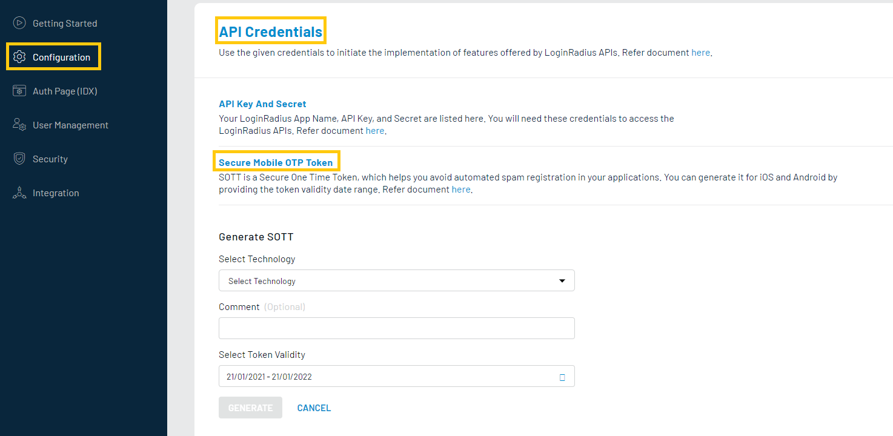

# Get Started - Android

The tutorial lets you implement LoginRadius user registration, login, profile, and log out in your Android mobile application.

> You must have the following:
>
> - Android SDK Version >= 15
>
> - Build Tools Version = 28.0.0 (changeable in build.gradle)
>
> - Android Studio >= 3.5.2

Watch the video to get started, or refer to the section below for the text-based guide.

<figure class="video_container">
<iframe width="560" height="315" src="https://www.youtube.com/embed/efM46qNSaeg" frameborder="0" allow="accelerometer; autoplay; clipboard-write; encrypted-media; gyroscope; picture-in-picture" allowfullscreen></iframe></figure>

---

> [Create an account](https://accounts.loginradius.com/auth.aspx?return_url=https://dashboard.loginradius.com/login&action=register) to get started if you don't have one yet!

## Get Credentials

Before using any of the APIs or Methods that LoginRadius provides, you need to get your **App Name** (when you signed up for the LoginRadius account, it created an app for you), **API Key**, and **SOTT**.

- In your LoginRadius Dashboard, navigate to **[Configuration > API Credentials](https://dashboard.loginradius.com/configuration)** and click the **API Key And Secret** subsection to retrieve your App Name and API Key:

  

- Now click the the **Secure Mobile OTP Token(SOTT)** subsection, the below screen will appear:

  

- Generate SOTT and make sure to copy the SOTT value (for security reasons, it's only visible once in the LoginRadius Dashboard).

## SDK Installation

Add the following dependency in your app's build.gradle:

```
implementation 'com.loginradius.android:androidsdk:4.8.0'
```

## Configuration

- Add the following code to the `onCreate()` method in `MainActivity.java`.

  ```

  LoginRadiusSDK.Initialize init = new LoginRadiusSDK.Initialize();
  init.setApiKey("<apikey>");
  init.setSiteName("<sitename>");
  init.setSott("<sott>");


  ```

- Replace the following placeholders in the above :

  - apiKey: **API Key** obtained in the [Get Credential](#getcredentials) step.
  - sott: **SOTT** obtained in the [Get Credential](#getcredentials) step.
  - siteName: **App Name** obtained in the [Get Credential](#getcredentials) step.

- Add the following permissions to the `AndroidManifest.xml`:

  ```
  <uses-permission android:name="android.permission.INTERNET" />
  <uses-permission android:name="android.permission.ACCESS_NETWORK_STATE" />
  <uses-permission android:name="android.permission.ACCESS_WIFI_STATE" />
  <uses-permission android:name="android.permission.GET_ACCOUNTS" />
  <uses-permission android:name="android.permission.MANAGE_ACCOUNTS" />
  <uses-permission android:name="android.permission.USE_CREDENTIALS" />

  ```

## Implement Registration

> Add a button to your application that calls below function for registration.

Add the following code to implement registration:

```
          private void doRegistration() {
             QueryParams params = new QueryParams();
             params.setEmailTemplate("<email-template>");        //put your emailTemplate(optional)
           String sott = "put_your_sott_here"; //Required
             final RegistrationData data = new RegistrationData();
             data.setFirstName("Lee");
             data.setLastName("com");
             data.setPassword("123456");
             Email emailObj = new Email();
             emailObj.setType("Primary");
             emailObj.setValue("xyz@mailinator.com");
             data.setEmail(new ArrayList<Email>(Arrays.asList(emailObj)));

             AuthenticationAPI api = new AuthenticationAPI();
             api.register(params,sott,data,new AsyncHandler<RegisterResponse>() {
                 @Override
                 public void onSuccess(RegisterResponse registerResponse) {
                     Log.e("data",registerResponse.getIsPosted().toString());
                 }
                 @Override
                 public void onFailure(Throwable error, String errorcode) {
                     Toast.makeText(MainActivity.this, error.getMessage(), Toast.LENGTH_LONG).show();

                 }
             });
          }

```

## Implement Login

> Add a button to your application that calls below function for login.

Add the following code to implement login:

```
private void doLogin() {
QueryParams params = new QueryParams();
params.setEmail("xyz@mailinator.com");
params.setPassword("123456");
params.setEmailTemplate("<email-template>"); //put your emailTemplate(optional)
AuthenticationAPI api = new AuthenticationAPI();
api.login(LoginActivity.this, params, new AsyncHandler < LoginData > () {
    @Override
    public void onSuccess(LoginData logindata) {
        List < String > result = new ArrayList < String > ();
        try {
            for (Field field: logindata.getClass().getDeclaredFields()) {
                field.setAccessible(true);
                Object value = field.get(logindata);
                Log.e("access_token", logindata.getAccessToken());
                Log.e("provider", logindata.getProfile().getProvider().toLowerCase());
                Log.e("FirstName", logindata.getProfile().getFirstName().toString());
            }
        } catch (Exception e) {
            e.printStackTrace();
        }
    }
    @Override
    public void onFailure(Throwable error, String errorcode) {
        Toast.makeText(LoginActivity.this, error.getMessage(), Toast.LENGTH_LONG).show();
        //this code will be used for getting pinAuthToken for calling setPinByPINAAuthToken API.
        if (errorResponse.getData() != null) { //the Data is generic type of property for fetching any value from data then we can use property key
            LinkedTreeMap linkedTreeMap = new LinkedTreeMap();
            linkedTreeMap.putAll((Map) errorResponse.getData());
            Log.e("pinAuthToken", linkedTreeMap.get("PINAuthToken").toString());
        }
    }
});
}

```

## Retrieve User Data using Access Token

> You will get an `access token` in response to Registration and Login functions.

Once the authentication is done, you can use the `access token` to retrieve profile data and handle other user functionality. Add the following code to get the user profile:

```
public void readAllUserProfile(String access_token) {
 QueryParams params = new QueryParams();
 params.setAccess_token(access_token);
 AuthenticationAPI api = new AuthenticationAPI();
 api.readAllUserProfile(params, new AsyncHandler < LoginRadiusUltimateUserProfile > () {
  @Override
  public void onSuccess(LoginRadiusUltimateUserProfile userProfile) {
   Toast.makeText(context, "First Name: " + userProfile.FirstName + " Last Name:" + userProfile.LastName, Toast.LENGTH_SHORT).show();
  }

  @Override
  public void onFailure(Throwable error, String errorcode) {
   Toast.makeText(context, error.getMessage(), Toast.LENGTH_SHORT).show();
  }
 });
}

```

> Call the `readAllUserProfile` function after login and verify that the user's profile information has been returned in the `onSuccess` callback.

## Explore Android Demo

Check out our Android demo to know how you can implement various LoginRadius features using SDK and its functions.

**[GitHub Demo Link](https://github.com/LoginRadius/android-sdk)** | **[Download Demo](https://github.com/LoginRadius/android-sdk/archive/master.zip)**

## Recommended Next Steps

How to manage email templates for verification and forgot password

How to personalize interfaces and branding of login pages

How to configure SMTP settings for sending emails to consumers

How to implement Social Login options like Facebook, Google

How to implement Phone Login

How to implement Passwordless Login

## Android SDK Reference

< Link to Android SDK doc >

## API Reference

< Link to APIs doc >
