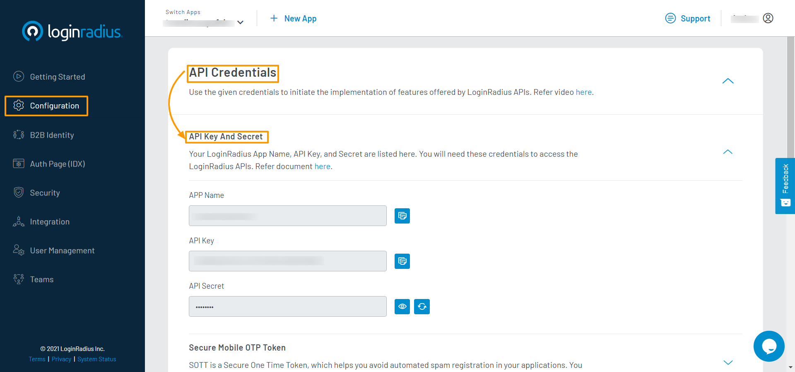

# Get Started - ASP&#46;NET Core

The purpose of this tutorial is to help you with implementing LoginRadius user registration, log in and log out functionalities in your ASP&#46;NET Core web application.

---------------------------------------------------

When you signed up for a LoginRadius account, an app was created for you. This app is linked to a ready to use web page, known as the [Auth Page (IDX)](https://www.loginradius.com/docs/developer/concepts/idx-overview/). When you make changes to your configurations in the LoginRadius Dashboard, your changes will automatically be reflected on your Auth Page (IDX). You can utilize this web page for your authentication requirements in your Web Forms application.

> [Create an account](https://accounts.loginradius.com/auth.aspx?return_url=https://dashboard.loginradius.com/login&action=register) to get started if you don't have one yet!

## Choose Theme

In your LoginRadius Dashboard, navigate to the **Auth Page (IDX)** section located in the left navigation bar and click the **Theme Customization** section. There you can select a design theme for your login page, or further customize the content displayed:

To preview your theme and content, click the **Go to your Login Page** link as highlighted on the above screen. There are various features already implemented on your Auth Page, such as Email and Password Login, User Registration, Forgot Password, and Remember Password.

## Get Credentials

Before using any of the APIs or methods that LoginRadius provides, you will need to retrieve your **App Name**, **API Key**, and **API Secret**.

In your LoginRadius Dashboard, navigate to **[Configuration > API Credentials](https://dashboard.loginradius.com/configuration)**, and click the **API Key And Secret** subsection to retrieve your API Credentials.

## &#46;NET Core Implementation

In this tutorial, we are assuming that you are following the Razor Page design pattern in your web application.
