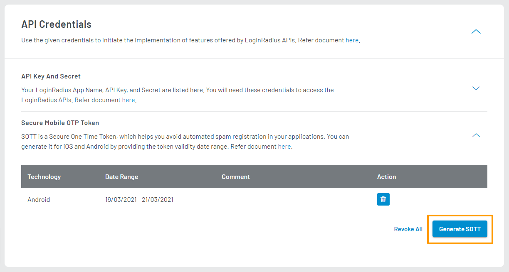
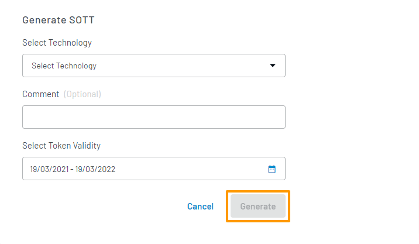

# Secure One Time Token

The LoginRadius Registration APIs require an API key and a Secure One Time Token to authenticate requests. This SOTT acts as a layer for you to control your consumer's access to register in your app.

A SOTT combines data from your API secret, your API key, and a defined timestamp (with a start and end time) into an encrypted string that will be validated when registration requests are made to the LoginRadius Registration API. The aim of this token is to ensure that only you (using your API secret) can grant access to consumers to register in your app.

## Generating Your SOTT

You can choose to either [generate static SOTTs](#generate-sott-in-your-dashboard) using the LoginRadius Dashboard, or generate dynamic SOTTs in your application using [the provided algorithm](#generate-sott-manually), or [our SDKs](#generate-sott-using-sdks).

### Generate SOTT in LoginRadius Dashboard

To generate SOTTs in your dashboard, log in to your [LoginRadius Dashboard](https://dashboard.loginradius.com/dashboard) account. From the left navigation panel, click **Configuration** and then navigate to the **API Credentials** section.

Click the **Secure Mobile OTP Token** sub-section, and the **Generate SOTT** screen will appear:


If you have already generated a SOTT, you can generate additional tokens by clicking the **Generate SOTT** button available at the bottom right of the screen as highlighted below:



Enter the required details in each respective field in the form provided, and click the **Generate** button to generate your SOTT.




> **Note:** When your SOTT is generated, be sure to save this somewhere, as this will not be saved in your dashboard.

These are the fields that you will find in the **Generate SOTT** form and their descriptions:

  * **Select Technology**: Select an option to be associated with this SOTT. The option you choose has no effect on your generated SOTT.

  * **Comment**: Enter an optional comment to be associated with this SOTT.

  * **Select Token Validity**: Select the date range for which this SOTT will remain valid. Your consumer will not be able to register using an expired SOTT.


> **Note:** We recommend that you dynamically generate SOTTs, as static SOTTs will usually have be valid for long periods of time.

### Generate SOTT Manually

The algorithm is provided below to dynamically generate SOTTs.

#### Generate PBKDF2 Key

The key used to encrypt the token string is generated using PBKDF2 using the following inputs:

* **Pseudo-random Function**: SHA1
* **Password**: Your LoginRadius API Secret
* **Salt**: 8 byte empty buffer
* **Iterations**: 10000
* **Key Length**: 32 bytes

#### Generate String

Using the date format `YYYY/MM/DD H:mm:ss`, declare the start and end dates for your SOTT's validity (in UTC). With these values, combine it into a string with your LoginRadius API key in the following format:

```
<Start Date>#<LoginRadius API Key>#<End Date>
```

For example, your string could look like the following:

```
2021/03/19 22:08:09#00000000-0000-0000-0000-000000000000#2021/03/19 22:18:09
```

#### Encrypt String

Using 256 bit AES encryption with mode CBC (aes-256-cbc), the string value `tu89geji340t89u2` as your initialization vector, and the PBKDF2 derived key, encrypt the formatted string. Your result should be a base64 encoded string.

#### Generate Hash of Encrypted String

Using the MD5 algorithm, generate a hash of the encrypted string. Your result should be a base16 (hex) encoded string.

#### Combine Encrypted String with MD5 Hash

Combine both the encrypted string with the MD5 hash in the following format:

```
<Encrypted String>*<Hash>
```

This is your SOTT that you can use to register your consumers with.

#### Example Implementation

Here is an example function in Node.js that will generate a SOTT for you:

```js
const crypto = require("crypto");

/**
 * @param {*} secret      Your LoginRadius API Secret
 * @param {*} key         Your LoginRadius API Key
 * @param {*} startDate   Start Date for token's validity
 * @param {*} endDate     End Date for token's validity
 */
function generateSott(secret, key, startDate, endDate) {
  return derivePbkdf2Key(secret).then(derivedKeyBuffer => {
    const formattedStringBuffer = generateFormattedStringBuffer(key, startDate, endDate);
    const encryptedStringBuffer = encryptString(derivedKeyBuffer, formattedStringBuffer);
    const encryptedStringHash = generateHash(encryptedStringBuffer);
    const resultSott = formatSott(encryptedStringBuffer, encryptedStringHash);

    return resultSott;
  });
}

function derivePbkdf2Key(secret) {
  return new Promise((resolve, reject) => {
    crypto.pbkdf2(secret, Buffer.alloc(8), 10000, 32, "sha1", function(error, derivedKey) {
      if (error) reject(error);
      resolve(derivedKey);
    });
  });
}

function generateFormattedStringBuffer(key, startDate, endDate) {
  return Buffer.from(`${startDate}#${key}#${endDate}`, "utf8");
}

function encryptString(keyBuffer, inputStringBuffer) {
  const ivBuffer = Buffer.from("tu89geji340t89u2", "utf8");
  const cipher = crypto.createCipheriv("aes-256-cbc", keyBuffer, ivBuffer);
  let cipherText = cipher.update(inputStringBuffer, "utf8", "base64");
  cipherText += cipher.final("base64");
  
  return cipherText;
}

function generateHash(inputBuffer) {
  const hash = crypto.createHash("md5");
  hash.update(inputBuffer, "utf8");

  return hash.digest().toString("hex");
}

function formatSott(encryptedString, encryptedStringHash) {
  return `${encryptedString}*${encryptedStringHash}`;
}
```

### Generate SOTT using SDKs

You can also use our provided SDKs to dynamically generate SOTTs. Our SDKs implement the same algorithm described above.

For example, using the Java SDK, you can generate a SOTT using the following method:

```java
Sott sott = new Sott();
String sottResponse = sott.main("<Your API Key>", "<Your API Secret>");
```


[Go Back to Home Page](https://lr-developer-docs.netlify.app)
