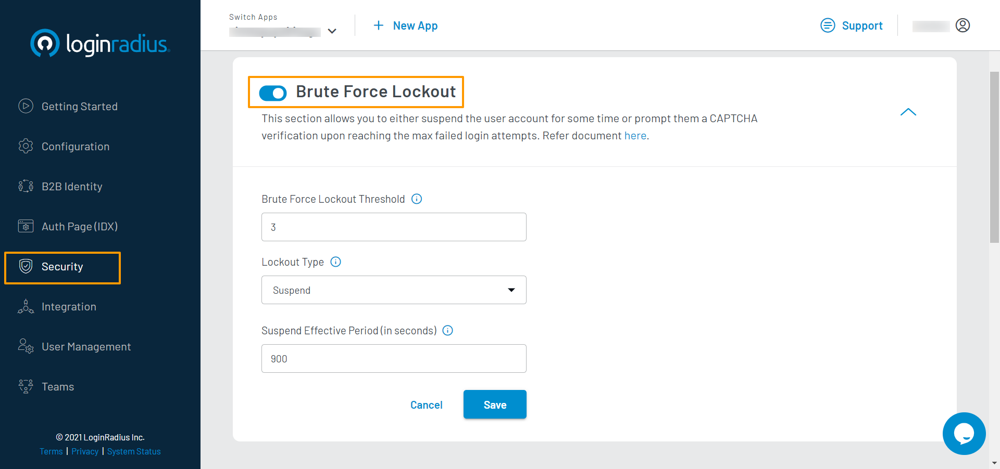
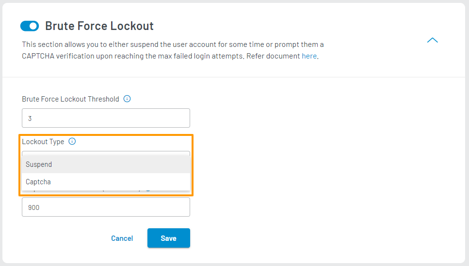

# Bruteforce Lockout

The Brute Force Lockout feature allows you to restrict account access based on failed login attempts. Once the limit of failed login attempts is reached, the customer will either get suspended for the configured period or prompted to complete an additional security step to log in.

## LoginRadius Configuration

1. Login to your [LoginRadius Dashboard](https://dashboard.loginradius.com/dashboard) account, from the left navigation panel, click **Security** and then navigate to the **Brute Force Lockout** section.

2. Click the down arrow, the Brute Force Lockout screen will appear:

   

3. Enter or select the following configuration details:

   * **Brute Force Lockout Threshold:** Set the desired maximum number of failed login attempts.

   * **Lockout Type:** Select the lockout type you wish to trigger when the threshold limit is reached. The following screen displays the available lockout type options:

     

   * **Suspend:** Select this option to prevent the customer from logging in for a specified amount of time (Suspend Effective Period), once the account is suspended.

     * **Suspend Effective Period:** The effective period for which the account is suspended. Default suspend effective period is 900 seconds.

     * **Captcha:** Select this option to prompt the customer to complete a CAPTCHA to log in when the maximum failed login attempt is reached.

       > Pre-requisites: You must have [Google reCAPTCHA V2](/guide/captcha/) configured in your LoginRadius Identity Platform to display captcha on lockout. 

[Go Back to Home Page](/)
