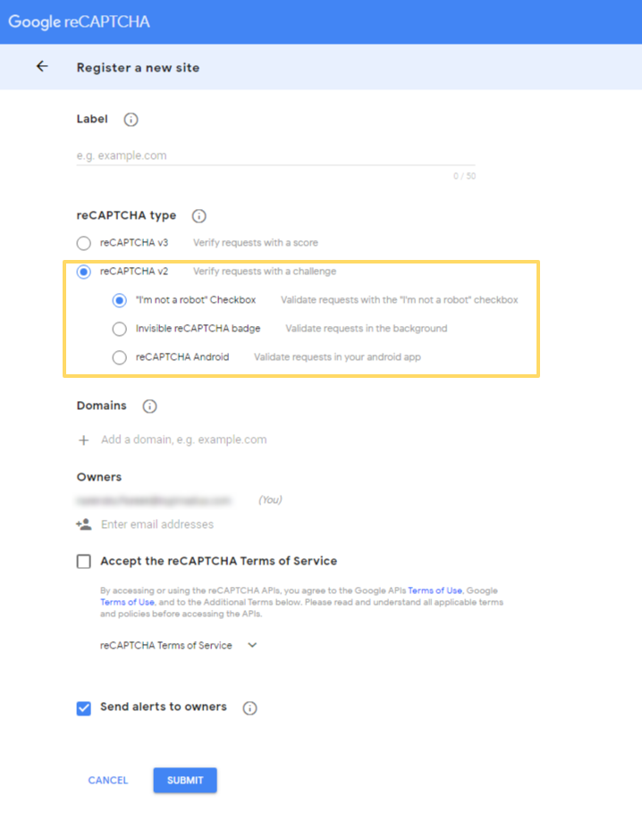
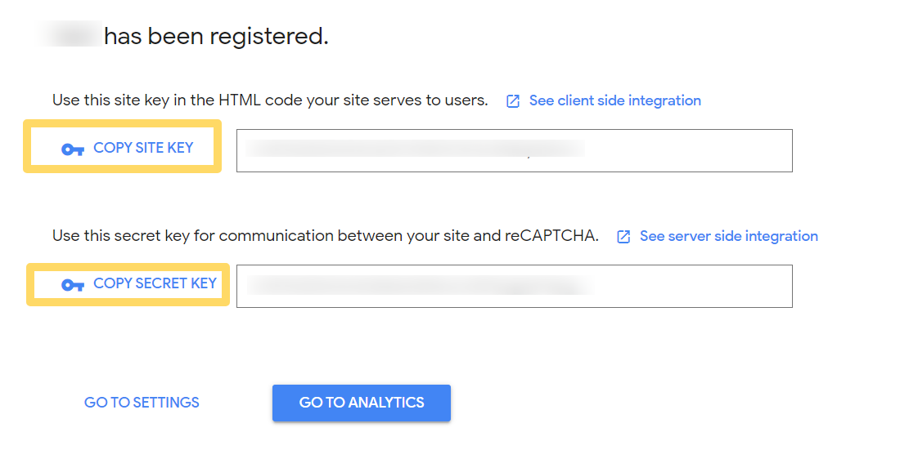
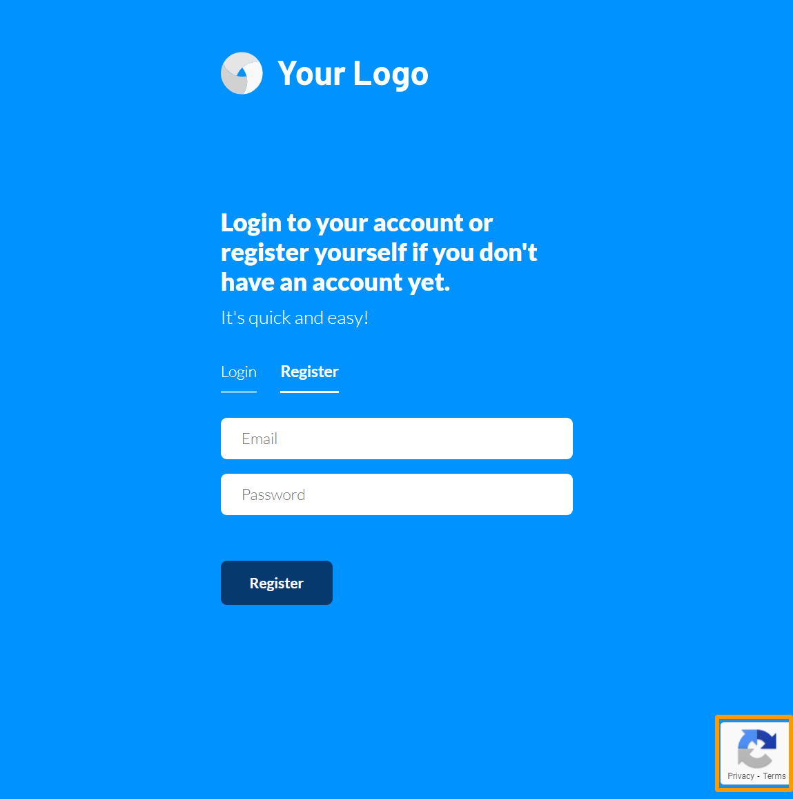

Developer

# Implement Captcha

LoginRadius Identity Platform provides you the feature to add another layer of security to your registration form by configuring CAPTCHA, which ensures that the person registering is not a bot.

> Note: CAPTCHA is mainly used as a security check to ensure only humans can pass through. Generally, bots are not capable of solving a CAPTCHA challenge.

As a part of your Login and Registration flows, LoginRadius reCAPTCHA settings allow you to enable [Google reCAPTCHA](#step-1-google-recaptcha-configuration), which is a service from Google that protects web applications from spam and abuse. It is easy for humans to solve, but hard for “bots” and other malicious software to figure out.

LoginRadius supports the use of Invisible reCAPTCHA. This version of reCAPTCHA provides a minimally intrusive experience to your consumers by tracking their mouse movements to identify if they are a bot. If so, it presents a CAPTCHA challenge on the screen.

The following explains the configuration and deployment of Google reCAPTCHA:

## Step 1: Google reCAPTCHA Configuration

This section covers the required configurations that you need to perform to implement the Google reCAPTCHA functionality.

1. Log in to your Google account, navigate to <a href="https://www.google.com/recaptcha/intro/v3.html" target="_blank">https://www.google.com/recaptcha/intro/v3.html</a>, and select **Admin console** on the top right, as highlighted in the following screen:

   

   You will be redirected to the reCAPTCHA's configuration section.

2. Click the **+ (create)** button, the following screen will appear:

   

3. Enter the name/label for the reCAPTCHA configuration (you can use your application’s name) and select the version of the reCAPTCHA you would like to use.

4. Under the **Domain**, enter your website’s domain (where this reCAPTCHA will be used). If you are implementing in your development environment, enter `localhost`. The purpose is to whitelist your application domain.

5. Click the **Submit** button and you will get the Public and Private Key. Use these Public and Private keys in to configure Google reCAPTCHA for your LoginRadius app

   

## Step 2: CAPTCHA Deployment

1. Log in to your <a href="https://dashboard.loginradius.com/dashboard" target="_blank">LoginRadius Dashboard</a> account, select your app, then from the left navigation panel, click the **Security** section and then navigate to the **CAPTCHA Setting** section.

2. Click the down arrow and the **CAPTCHA Setting** screen will appear:

   

3. Enter or select the following CAPTCHA details:

   - reCAPTCHA Type: Choose the type of reCAPTCHA from the dropdown.
   - Public Key: Enter the Public Key provided by Google reCAPTCHA.
   - Private Key: Enter the Private Key provided by Google reCAPTCHA.

   > **Note:** Check the [Step 1](#step-1-google-recaptcha-configuration) to get the Public and Private key and to register for Google reCAPTCHA.

4. Click the **Save** button.

## Step 3: See Result

If your configuration was successful, you will be able to see the following badge on the bottom right of your Auth Page `<your-app-name>.hub.loginradius.com/auth.aspx` Registration form, as highlighted in the below screen:

[Go Back to Home Page](/)
