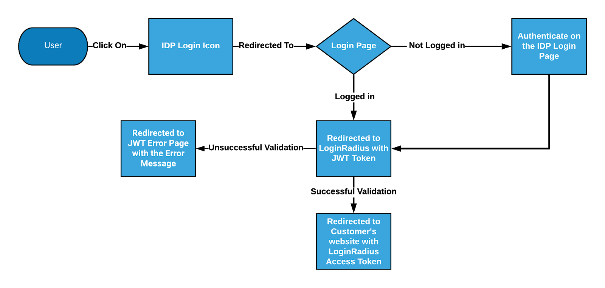
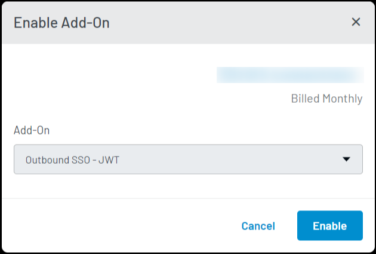

<span class="devloper-premium plan-tag">Developer Pro</span>
<span class="devloper-premium plan-tag">Add on</span>

# Outbound SSO - JWT

This guide will take you through the process of setup and implementation of the outbound SSO using JWT. It covers the following:

- [Functional flow of JWT SSO](#outbound-sso---jwt-flow)
- [Configuration you need to do in LoginRadius Dashboard](#loginradius-dashboard-configuration)
- [Implementing JWT SSO with LoginRadius APIs](#jwt-loginradius-apis)

## Outbound SSO - JWT Flow

The following flow chart shows how JWT flow works between IDP and SP, where IDP is LoginRadius and SP is service provider application:



LoginRadius supports a delegated redirect SSO flow through which you can redirect your consumer to [LoginRadius Auth Page (IDX)](/guide/customize-auth-page), where your consumer can do account management actions.

Upon successful login or social login, the consumer will be redirected to the return URL along with the JWT for this authentication session. Here is the step by step instruction for setting JWT SSO flow:

1. First of all, configure a JWT app in your LoginRadius Dashboard. Refer to the JWT [LoginRadius Dashboard Configuration](#loginradius-dashboard-configuration) section for how to configure JWT in the LoginRadius Dashboard.

2. Whitelist the service provider URL in the LoginRadius Dashboard. Follow <a href="https://www.loginradius.com/docs/developer/faq/#how-to-whitelist-domain-in-loginradius-dashboard" target="_blank">this</a> for information on how to whitelist URLs in the LoginRadius Dashboard.

3. The following is the LoginRadius JWT SSO URL: `https://cloud-api.loginradius.com/sso/jwt/redirect/token?apikey=<LRapikey>&jwtapp=<jwtAppName>&return_url=<encode(service provider url)>`

4. If a consumer is not logged in on your service provider app then direct it to the LoginRadius JWT SSO URL `(https://cloud-api.loginradius.com/sso/jwt/redirect/token?apikey=&jwtapp=&return_url=)`

5. The JWT SSO URL will redirect to your LoginRadius Auth Page(IDX) `(https://<your-app-name>.hub.loginradius.com)`

If the consumer is not logged into the hosted page, the consumer will be asked to log in. After authentication, the consumer will be redirected back to the return URL with the JWT as a query parameter.

## LoginRadius Dashboard Configuration

This section covers the required configurations that you need to perform in the LoginRadius Dashboard for JWT Login.

1. Log in to your <a href="https://dashboard.loginradius.com/" target="_blank">LoginRadius Dashboard</a> account, select your app and navigate to <a href="https://dashboard.loginradius.com/integration" target="_blank">Integration</a>.

   The following screen will appear:

   

2. Click **Add** option for adding a new JWT app. The following configuration options will appear:

   

3. Either search for JWT in the search bar or go to the **Select Category** dropdown and select **Outbound SSO**. Locate **Outbound SSO - JWT** and click the **Add Me**.

   The following pop-up will appear:
   

   Click the **Enable** button. The app will appear in **Available Integrations**.

   

4. Click the **Let's Configure** under Oubound SSO - JWT. The following screen will appear:

   

5. You need to provide or select the following values to configure the JWT App.

   - **App Name:** A name that will be used by LoginRadius to identify the provider originating the request. If you have multiple JWT apps, the name should be unique for each. You can use any name, e.g., comapany_Jwt_app. This name will be used in LoginRadius to identify your app during API calls.

   - **Secret Key:** Enter the secret key obtained from the service provider. It would be used to sign the JWT and will later be used to verify the received JWT.

   - **Query String Parameter:** The query parameter name in which LoginRadius sends JWT during JWT SSO flow. After authentication, the redirect URL will contain a JWT under this parameter name. The redirect URL will look like this: `<redirecturi>?<query string parameter>=JWTtoken`

   - **Algorithms:** Algorithm to sign JWT. LoginRadius supports the following algorithms:

        - HS256
        - HS384
        - HS512
        - RS256
        - RS384
        - RS512

   - **Enter The Key** Specify the Key-value pair of LoginRadius profile data points that you want to receive in the JWT payload.

        - Enter any value for the key column( left column), these values will be used as keys for claims in the payload.

        - Select the desired LoginRadius profile field name in the profile key (right column). The values for these fields from the consumer's profile in LoginRadius will be returned to the JWT payload.

     Similarly, by clicking the **Add Row** button, you can map multiple attributes.

6. Click the **Save** button. Your Outbound SSO -JWT configurations are now complete.

# JWT LoginRadius APIs

If you are directly implementing your Login forms or already have an access token or want to generate a JWT based on email/username/Phone number or a password, you can leverage the following APIs:

- <a href="https://www.loginradius.com/docs/developer/references/api/jwt/#jwt-token" target="_blank">JWT Token</a>: This GET API is used to exchange access token with your JWT.
- <a href="https://www.loginradius.com/docs/developer/references/api/jwt/#jwt-token-by-email" target="_blank">JWT Token by Email</a>: This API is used to get a JWT by Email and Password.
- <a href="https://www.loginradius.com/docs/developer/references/api/jwt/#jwt-token-by-username" target="_blank">JWT Token by Username</a>: This API is used to get JWT by Username and password.
- <a href="https://www.loginradius.com/docs/developer/references/api/jwt/#jwt-token-by-phone" target="_blank">JWT Token by Phone</a>: This API is used to get JWT by Phone and password.

The response from the above APIs will look like this:

```
{
 signature: <JWTresponse>
}
```

For more information on `<JWTresponse>`, refer to <a href="https://www.loginradius.com/docs/developer/concepts/jwt" target="_blank">JWT Token Structure</a>.


[Go Back to Home Page](/)
