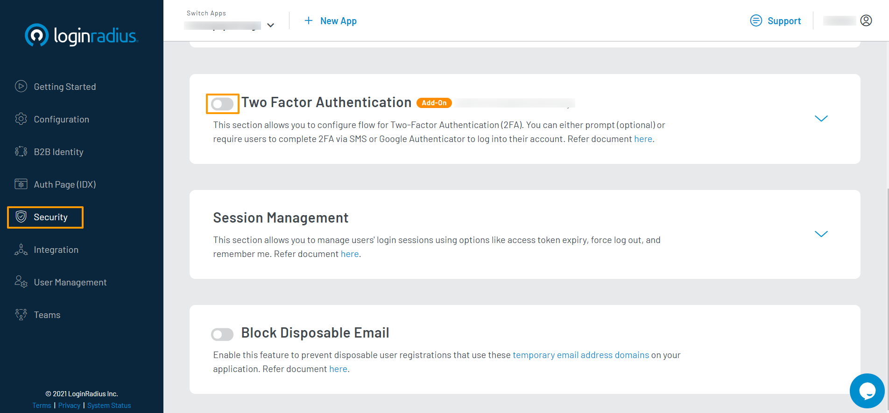
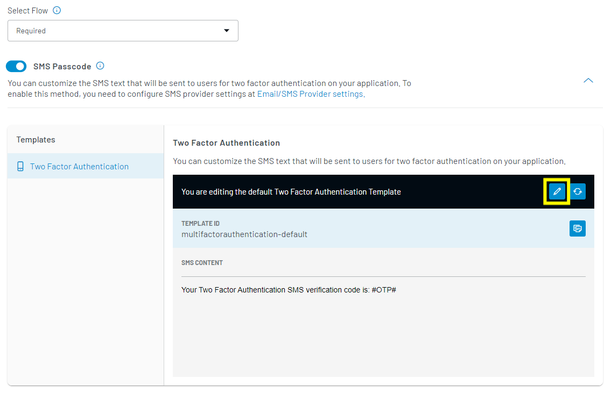
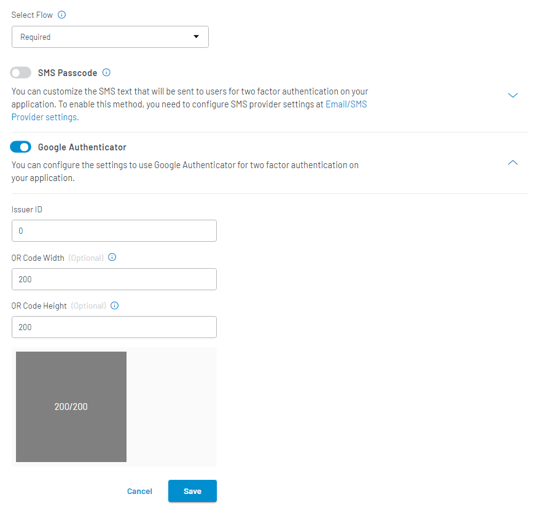
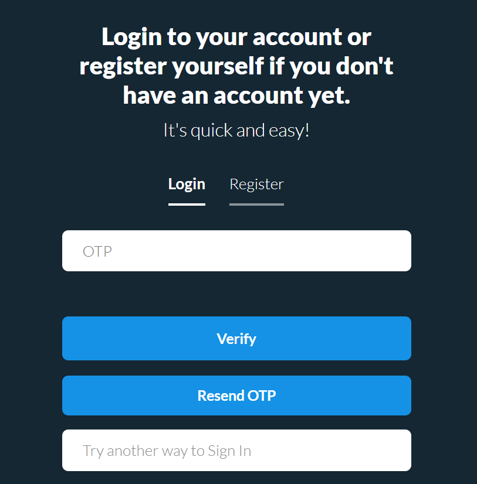
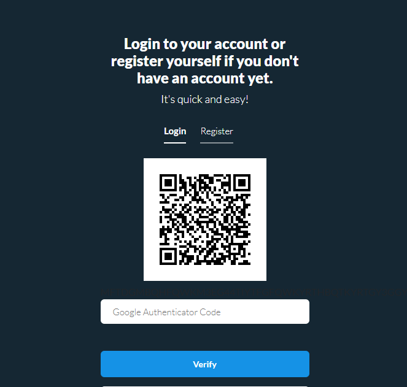

# Implement Two-Factor Authentication (2FA)
The LoginRadius Identity Platform provides Two-Factor Authentication to add an extra layer of security for the consumers' accounts. With this feature enabled, once the consumer enters their login credentials, they are sent an authentication code to complete the login. This feature is available on an add-on basis for your LoginRadius account.

You can keep 2FA optional or required for the users as per your business requirement. This guide explains how to configure the Two-Factor Authentication for your consumers. 

> Note: When both [Passwordless Login](/guide/passwordless-login/) and Two Factor Authentication (2FA) are implemented for your application, the consumer will not be prompted for 2FA, if they choose to authenticate with the Passwordless Login method.

You can implement the 2FA in two following ways:

* **SMS Passcode**: A verification OTP is sent to the consumer's registered phone number. The consumer will be logged in upon verifying this OTP. 

* **Google Authenticator**: Consumer needs to enter the verification code from Google Authenticator linked account. Upon verification, the consumer will be logged in. 

## Step 1: Enable Two Factor Authentication  

1. Login to your [LoginRadius Dashboard](https://dashboard.loginradius.com/dashboard) account, from the left navigation panel, click **Security** and then navigate to the **Two Factor Authentication** section. Click on the switch to enable the Two Factor Authentication Add-On.

   

2. When the Add-On dialog appears, click **Enable**

   

## Step 2: Choose 2FA Method 

1. Choose the desired Two-Factor Authentication methods from **SMS Passcode** and **Google Authenticator**, and whether it is going to be optional or required for the consumers:

   

    * **Optional**: Consumers will have the ability to enable or disable Two Factor Authentication on login.
    
    * **Required**: Consumers will be required to authenticate themself using the enabled 2FA option in addition to the initial authentication for login.

## Step 3: Configure 2FA Templates

### SMS Passcode

Two-Factor Authentication with SMS Passcode will be the default option for the consumers, and in this section, you are allowed to customize the Two Factor Authentication template.

1. To access the respective SMS template, click the down arrow available next to the SMS Passcode option.The following screen will appear:

   

2. To edit the template used for the SMS Passcode method, click the Edit icon given in the action bar highlighted in the previous step.

   >  Note: Two Factor Authentication SMS template is sent to your users when they authenticate through their credentials. This SMS will contain an OTP that the users will need to enter to complete the log in. [Phone Login](/guide/phone-login) should be enabled for your application to use this 2FA method.

### Google Authenticator

To enable two-factor authentication with Google Authenticator, you need to configure the following settings under the Google Authenticator section.

1.  Select the Google Authenticator checkbox.

2.  Click the down arrow available next to the Google Authenticator option. The following section will appear on the screen:

    

3.  Enter the Issuer ID, it can be your product/company name.

4.  Enter valid values for QR Code Width and Qr Code Height (ideal values are 200 for both)

5.  Save the settings.

The two-factor authentication is now configured.

## Step 4: Check Auth Page (IDX)

**SMS Passcode**

In case of SMS Passcode, upon validating the login credentials, the consumer will get an SMS with verification OTP. Upon verifying with OTP, the consumer will be logged in. 

**Google Authenticator**

To verify the 2FA with Google Authenticator on your authentication page, open your **Auth Page (IDX)** `https://<your-app-name>.hub.loginradius.com/auth.aspx`. It will display the following google authenticator options (where the consumer needs to scan the QR code via their google authenticator app or enter the code generated via the app):

[Go Back to Home Page](/)

