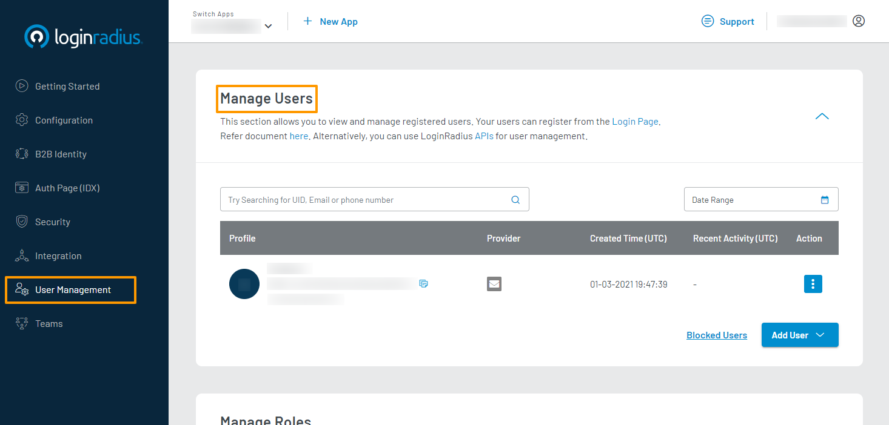
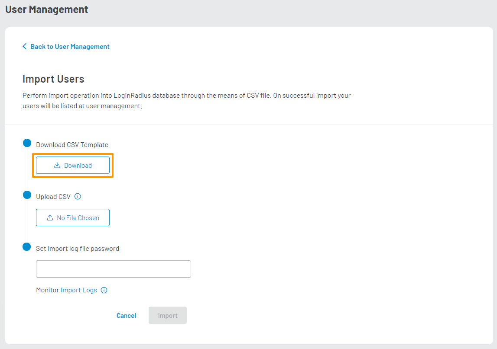
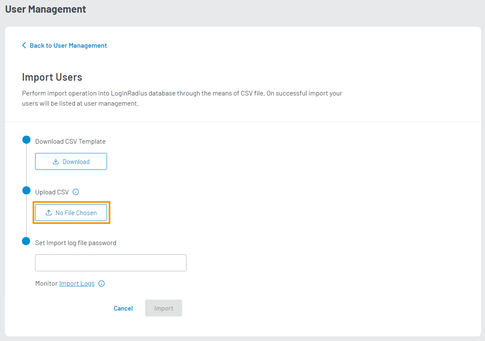
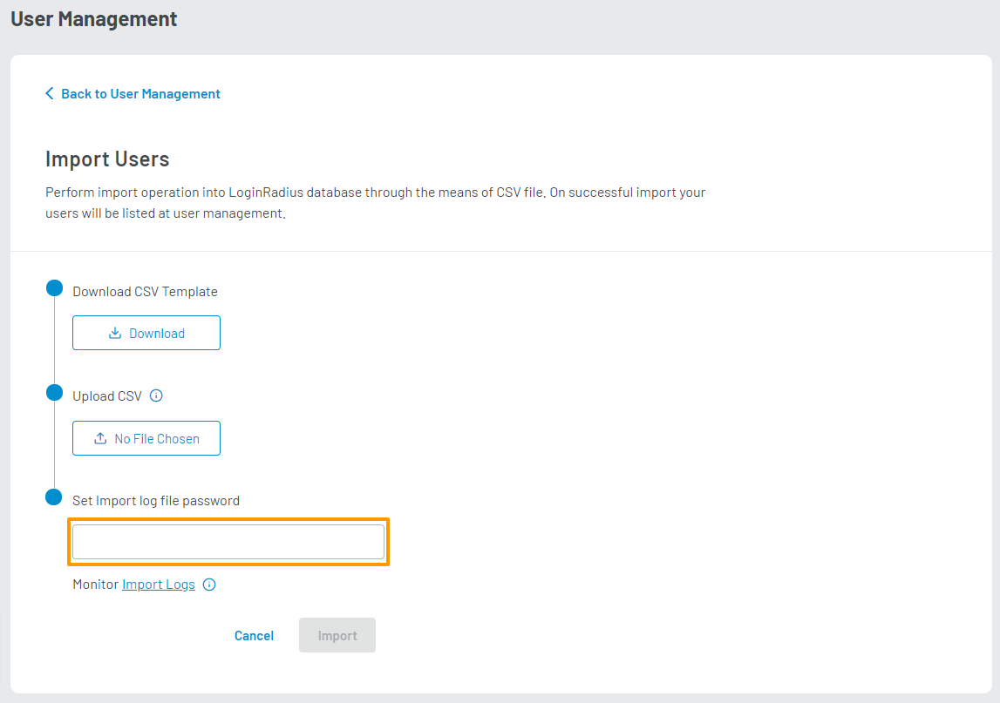
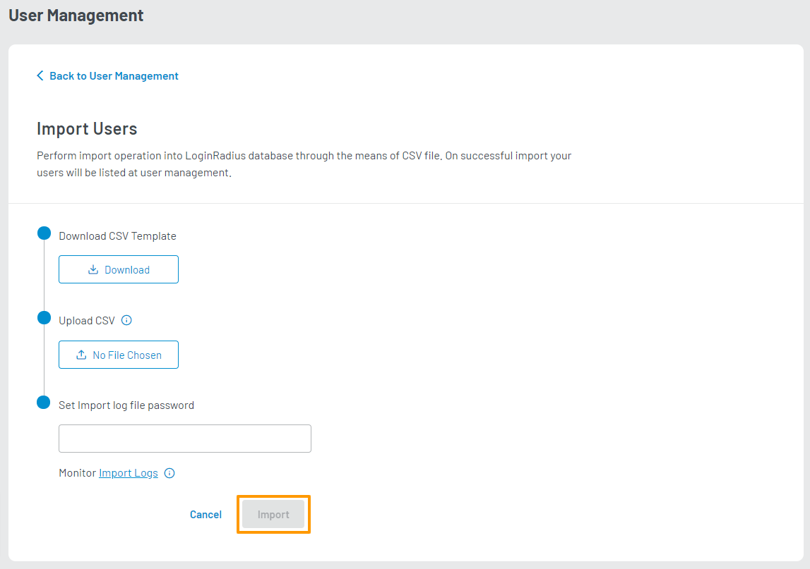
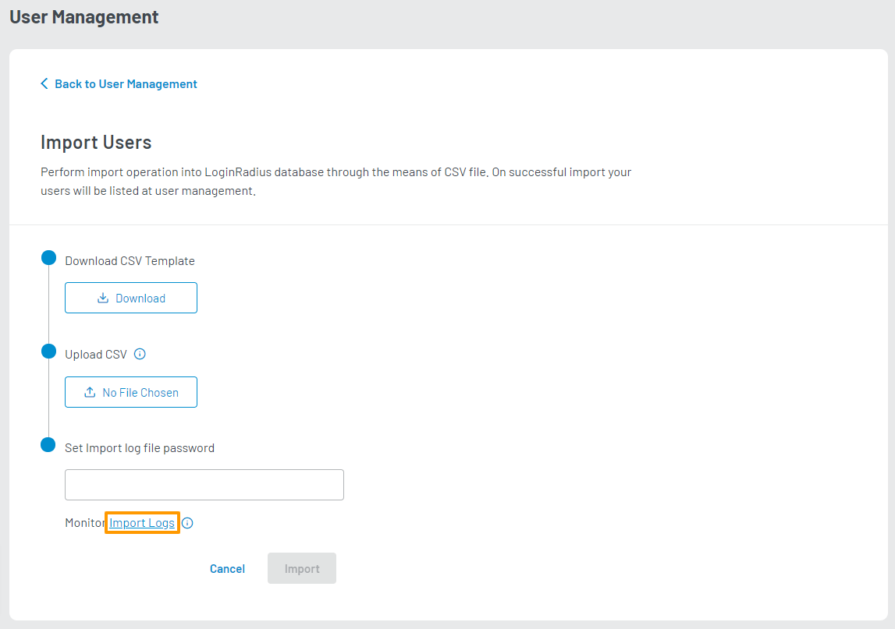
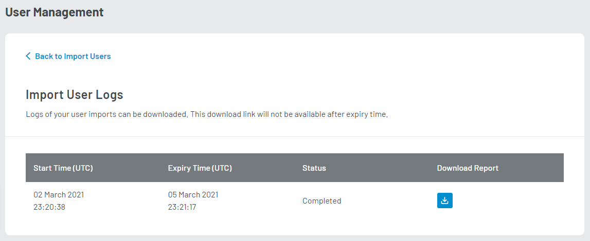
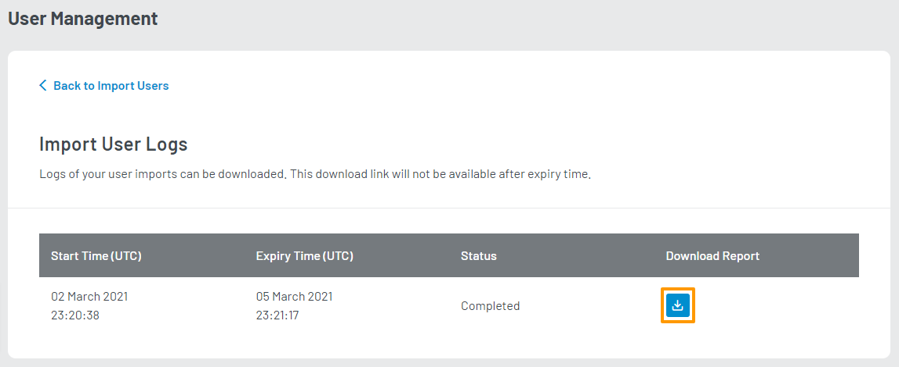

# Migrate User Data

This guide explains how to mass import user data from another application/service/database into the LoginRadius database using CSV files.

## Access the Import Users Section

1. Log in to your [LoginRadius Dashboard](https://dashboard.loginradius.com/dashboard) account. From the left navigation panel, click **User Management** and then navigate to the **Manage Users** section.

2. Click the down caret, and the **Manage Users** screen will appear:

  

3. At the bottom right of the screen, click the **Add User** button and select the **Import Users** option in the dropdown menu:

  

  The **Import Users** screen will appear as below:

  

## Importing Users

1. Download the CSV template for reference.

  

2. Export your customer data into a similar CSV format. Using the provided template as a guide, map each value of your data into the template's respective field. The first line of your CSV file will be skipped during processing.

3. Upload the CSV file containing your user data by clicking the upload button available under the **Upload CSV** option:

  

4. Set the password for the log file that will be generated from your import in the provided input field:

  

5. Click the **Import** button to submit your import request.

  

  > Note: After the import process is complete, LoginRadius will send you an email notification with a secure link to access your import report file.

  > Note: Depending on the number of requests in the pipeline, it may take up to an hour for your import request to complete.

## Checking Import Logs

You can view the request history for your import requests, as well as the download links for its report if available. You can access your logs by clicking the **Import Logs** link as highlighted on the screen below:

  

The **Import User Logs** table will show as below:

  

In your logs table, you will find the following details for each import request:

  * **Start Time (UTC)**: The time at which the import request was submitted.

  * **Expiry Time (UTC)**:  The time at which the report link expires.

  * **Status**: The current status of the import request.

  * **Download Report**: The download link for the import report file.

You can download the report for your import request by clicking on the download button available in its respective **Download Report** column. This file is a password-protected CSV containing the records which LoginRadius failed to import, as well as the reason for its failure.

  
