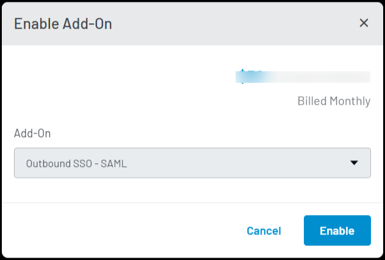
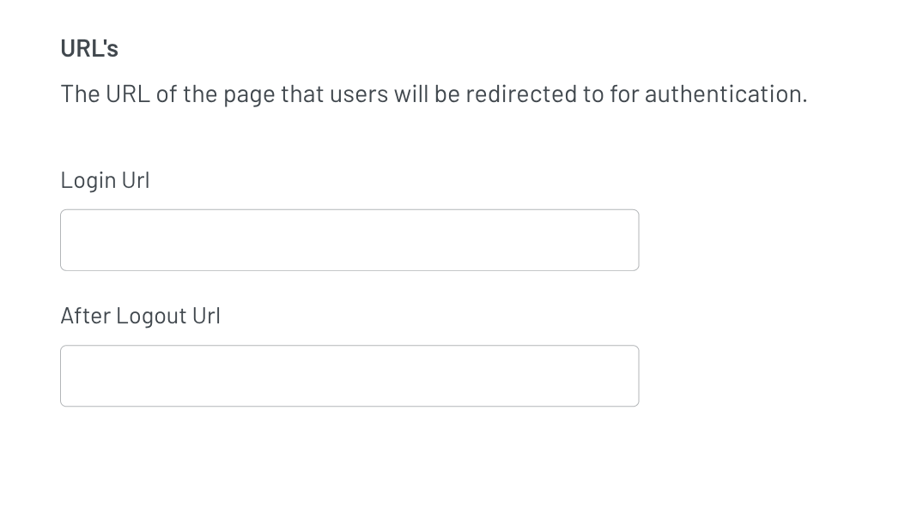
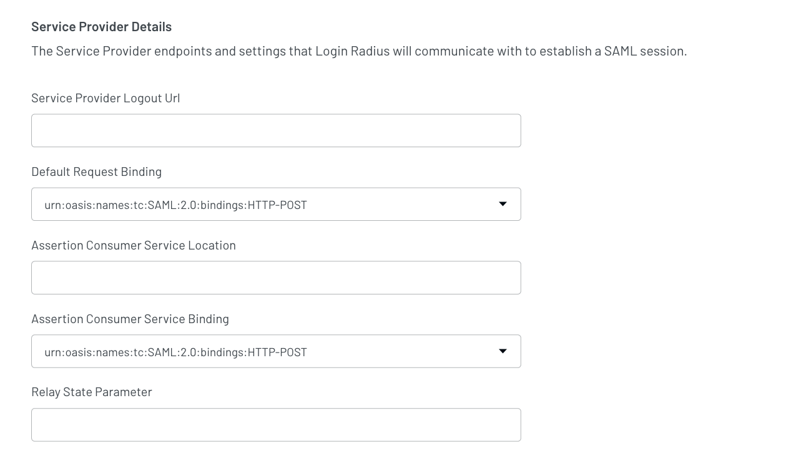
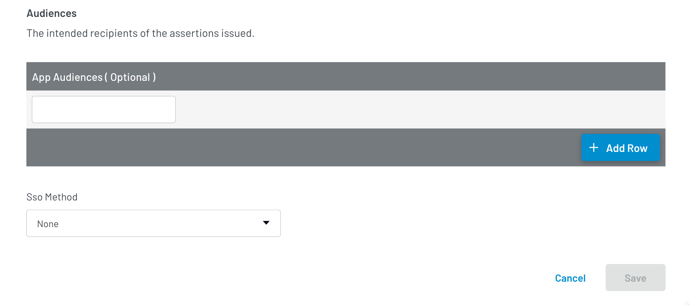

<span class="devloper-premium plan-tag">Developer Pro</span>
<span class="devloper-premium plan-tag">Add on</span>

# Outbound SSO SAML  
This document goes over how you can enable outbound SSO using SAML. In this setup, your LoginRadius app acts as IDP (identity provider).

## Service Provider (SP) Configuration

1. Login in to your service provider app.
2. Enable and configure SAML SSO method.
3. Save the service provider details for the next step.

## LoginRadius Dashboard Configuration (IDP)

1.  Log in to your <a href="https://dashboard.loginradius.com/" target="_blank">LoginRadius Dashboard</a>.

2.  Select your app, then from the left Navigation panel, click the **Integration** and then click the **Add** button in the **Configured Integration** section.

    


3.  Either search for **SAML** in the search bar or go to the **Select Category** dropdown and select Outbound SSO. Locate Outbound SSO - SAML and click the **Try It For Free**.

    The following pop-up will appear:
    
    

4. Click **Enable** button from the above pop-up and then click the **Let’s Configure** option under the Outbound SSO-SAML. The following screen will appear:

    

5. Add SAML app by clicking **[Add App](#configure-saml-app)** or **[Add From Metadata File](#add-metadata-file)** button.

### Add Metadata File
If the **Add From Metadata File** option is selected, then add the metadata file of the SAML file to connect with SSO.


The below steps are if the **Add App** option is selected.

### Configure SAML App

1. Select the SAML version, Loginflow(SP or IDP), and add the SAML App name.

   

2. Enter LoginRadius' Certificate and Key in **Id Provider Certificate Key** and **Id Provider Certificate**.

   

   **Generate LoginRadius' Certificate and Key**
   Self-signed certificate and key can be generated by one of the following ways:

   * Using online tools, for example, with Bits and Digest Algorithm 2056, SHA256, respectively.

   * Using the following OpenSSL commands (currently, LoginRadius is only supporting the PKCS1 private key format):

     * Generate the **Id Provider Certificate Key** from the following command:
       ```
       openssl genrsa -out private.key 2048
       ```
     * View the private key from the last step:
       ```
       vi private.key (for Linux OS)
       ```
     * Generate the **Id Provider Certificate** form the private key:
       ``` 
       openssl req -new -x509 -key private.key -out 
       certificate.cert -days 365 -subj /CN=<loginradius-app-name>.hub.loginradius.com
       ```
     * View the **Id Provider Certificate**  from the last step:
       ```
       vi certificate.cert (for Linux OS)
       ```
    
    >**Note:** To view the **Id Provider Certificate Key** and **Id Provider Certificate** for Windows OS, go to the folder where you are running the command, and the key will be generated in the private.key and certificate.cert file within the same folder.

   Copy the values of LoginRadius' certificate and key with headers and paste in the **Id Provider Certificate** and **Id Provider Certificate Key** fields, respectively.

   
3. Add the key-value pairs in the **Attributes** section(optional).

   

4. Select the **Name Id Format** value from the dropdown.    The default value is **urn:oasis:names:tc:SAML:1.1:nameid-format:unspecified**.

5. Enter the URLs of the page that users will be redirected to for authentication in **Login URL** and **After Logout URL**.

   Where Login URL is of your <a href="https://www.loginradius.com/docs/developer/concepts/idx" target="_blank">Auth Page (IDX)</a>.

    

6. Enter the Service Provider endpoints and settings that LoginRadius will communicate with to establish a SAML session in the **Service Provider Details** section.

    In **Assertion Consumer Service Location**, enter the **IdP-Initiated Login URL**, which you will get from the SAML supported app dashboard or metadata file.
    
    
    
7. In the **Audiences** section, add the intended recipients of the assertions issued.(optional)

    

8. Select the **HTTP Post** SSO method from the dropdown list.

9. Once all the required fields are completed, scroll down and click **Save**.

> **Note:** LoginRadius supports both IDP Initiated Login and SP Initiated Login, for more details, refer to <a href="https://www.loginradius.com/docs/developer/concept/loginradius-as-identity-provider" target="_blank">this document</a>.


[Go Back to Home Page](/)
