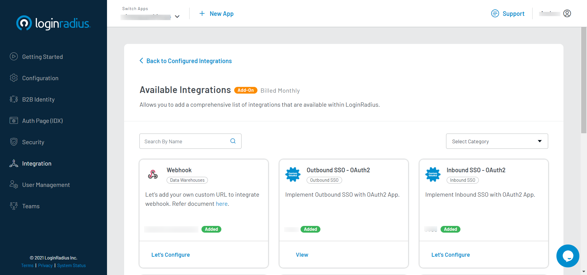
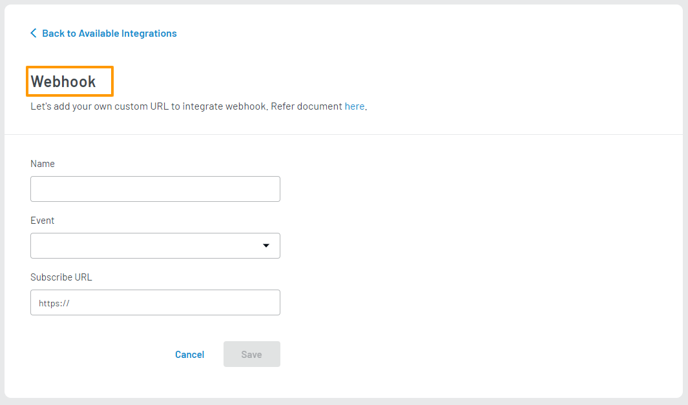
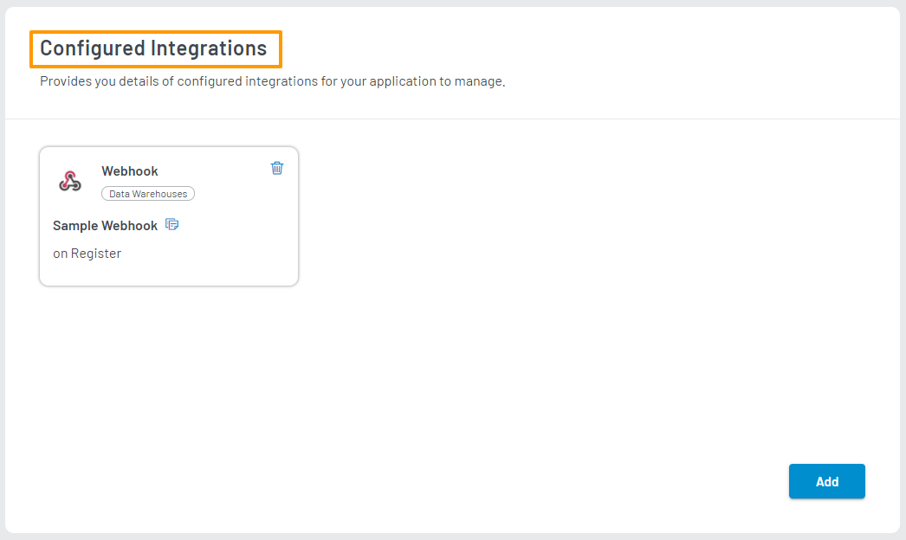

# Setup Webhooks

Webhooks allow you to build or set up integrations that subscribe to certain events on LoginRadius. When one of these events is triggered, LoginRadius automatically sends a POST payload over HTTPS to the Webhook's configured URL in real-time. You can use Webhooks to update an external tracker or update a backup mirror.

>**Note:** Upon submitting the request to the configured Webhook URL, LoginRadius does not track payload deliverability.

This guide explains how to configure webhook in [LoginRadius Dashboard](https://dashboard.loginradius.com/).


## Configuration

### Step 1: Visit Integration Section 
Log in to your [LoginRadius Dashboard](https://dashboard.loginradius.com/) account, select your app, then from the left navigation panel, click the **Integration** and the Configured Integrations screen will appear:


### Step 2: Add Webhook

Click the **Add** button from the above screen, and you will find the list of all available integrations as displayed in the below screen:



Click the **Let's Configure** button in the Webhook tile as on the above screen and follow step 3.

### Step 3: Configure Webhook

Enter or select the following details on the Webhook screen:

- **Name**: Enter the name of the Webhook
- **Event**: Choose the type of event from the dropdown.

  | PLAN | ALLOWED EVENTS |
  |----|----|
  | **Developer**	|Login, Register, UpdateProfile, ResetPassword, ChangePassword, emailVerification, LinkAccount, UnlinkAccount, InvalidateEmailVerification
  | **Developer Pro**	| Login, Register, UpdateProfile, ResetPassword, ChangePassword, emailVerification, BlockAccount, DeleteAccount, AssignRoles, UnassignRoles, LinkAccount, UnlinkAccount, VerifyPhoneNumber, UpdateCustomobject, DeleteCustomObject, CreateCustomObject, InvalidateEmailVerification, RemoveRoleContext

- **Subscribe URL**: Enter the URL where payload data will be sent when the webhook event is triggered.

The following displays the Webhook screen:




Click the **Save** button after providing the required details.


You will find the successfully configured webhook in the **Configured Integrations** section as displayed in the below screen:



>Note: You can change the list of subscribed events through the API at any time. By default, Webhooks are only subscribed to the push event.

## Webhook Handling

Once you configure the webhook with an event, LoginRadius triggers that webhook every time for that event. For example, a webhook subscribed URL configured for a Login event will receive a POST request on your server with the below sample payload:

**Trigger Method**: POST

**Format**:

```javascript
{
   "HookName":"login",
   "Time":"2018-07-31T09:03:18Z",
   "HookId":"50*****5-***1-4**7-9**e-fc8*****64eb",
   "Data":{
      "Identities":[
         "<Array of Identities>"
      ],
      "Password":"83c***f5559****7e7c***9708*****fd9ebbe6******62f648b0*****e0202:XD***Sxj",
      "LastPasswordChangeDate":"2018-03-05T22:13:36.48263Z",
      "PasswordExpirationDate":"2019-07-31T09:03:12.298Z",
      "LastPasswordChangeToken":"1542daac-4df0-4270-b5b5-5d7922492d7e",
      "EmailVerified":false,
      "IsActive":true,
      "IsDeleted":false,
      "Uid":"8061*****d1241******3297*****4b9",
     },
}
```
Where: 
- **HookName**: Webhook event which is triggered.
- **Time**: The timestamp when the hook is triggered.
- **HookId**: A uniquely generated number associated with the triggered hook.
- **Data**: The object that contains information about the event associated with the webhook.

## Webhook Security

LoginRadius follows the best practices to ensure your endpoint security and provides several ways to verify that triggered events are securely coming from LoginRadius:

> Note: You can change the list of subscribed events through the API at any time. By default, Webhooks are only subscribed to the push event.

All the Webhooks configured URL must use HTTPS as it is more secure. To use HTTPS, you must have a valid SSL/TLS certificate.
A signature field is passed in every Webhook payload header to the subscribed URL. The signature field value contains API secret and payload body in the hashed form. You can use the signature data field to verify that the source of data for each incoming POST request is LoginRadius.

The following is a sample script in .NET that can be used to generate a signature field from the LoginRadius API secret and Webhook payload Body. You can compare this generated signature with the signature field value in the Webhook payload header to validate the Webhook source of data.

Replace <LoginRadius API secret> with API secret for your LoginRadius account in the below code. Replace <Webhook payload body> with Webhook payload Body in string format. The code will write the derived signature in the console.


```javascript
using System;
using System.Text;
using System.Security.Cryptography;

public class Program
{
    private const string key = "<LoginRadius API secret>";
    private const string message = "<Webhook payload body>";
    private static readonly Encoding encoding = Encoding.UTF8; 

    static void Main(string[] args)
    {
        var keyByte = encoding.GetBytes(key);
        using (var hmacsha256 = new HMACSHA256(keyByte))
        {
            hmacsha256.ComputeHash(encoding.GetBytes(message));

            Console.WriteLine("Result: {0}", ByteToString(hmacsha256.Hash));
        }
    }
    static string ByteToString(byte[] buff)
    {
        string sbinary = "";
        for (int i = 0; i < buff.Length; i++)
            sbinary += buff[i].ToString("X2"); /* hex format */
        return sbinary;
    }    
}
```
## Webhook Sample Header

All webhook POST request headers will contain the following fields: host, accept, accept-encoding, content-type, request-context, request-id, signature, user-agent, content-length, connection.

Here is the sample for the Webhook payload header:


## Webhook Sample Payload Body

All webhook request payload contains the configured webhook name, time at which the webhook triggered, webhook id, and information about the event associated with the webhook. The following is a sample payload body:


```javascript
{
    "HookName": "<Web Hook Name>",
    "Time": "2019-06-11T20:27:56Z",
    "HookId": "079***b7-7491-4**9-91fa-eb*********a4",
    "Data": {
        "Password": "\rL��̃�R�J\u001b�*X����<l",
        "LastPasswordChangeDate": "2019-05-09T04:16:35.073Z",
        "PasswordExpirationDate": null,
        "LastPasswordChangeToken": null,
        "EmailVerified": true,
        "IsActive": true,
        "IsDeleted": false,
        "Uid": "7*******948e******c438******cc50a8",
        "CustomFields": {
            "OrganizationID": "132165"
        },
        "IsEmailSubscribed": false,
        "UserName": null,
        "NoOfLogins": 38,
        "PhoneId": "+11234567890",
        "PhoneIdVerified": false,
        "ExternalUserLoginId": null,
        "RegistrationProvider": "Email",
        "IsLoginLocked": false,
        "LoginLockedType": 0,
        "LastLoginLocation": "Washington, United States",
        "RegistrationSource": "API",
        "IsCustomUid": false,
        "UnverifiedEmail": null,
        "IsSecurePassword": true,
        "PrivacyPolicy": {
            "Version": "v1",
            "AcceptSource": "",
            "AcceptDateTime": "2019-05-09T04:24:17.846Z"
        },
        "ExternalIds": null,
        "IsRequiredFieldsFilledOnce": true,
        "ID": "25be****7257****8b5e*****29eea63",
        "Provider": "Email",
        "Prefix": null,
        "FirstName": "bhola",
        "MiddleName": null,
        "LastName": "pappu",
        "Suffix": null,
        "FullName": "bhola pappu",
        "NickName": null,
        "ProfileName": null,
        "BirthDate": null,
        "Gender": null,
        "Website": null,
        "Email": [
            {
                "Type": "Primary",
                "Value": "example1313@example.com"
            }
        ],
        "Country": null,
        "ThumbnailImageUrl": null,
        "ImageUrl": null,
        "Favicon": null,
        "ProfileUrl": null,
        "HomeTown": null,
        "State": null,
        "City": null,
        "Industry": null,
        "About": "leader",
        "TimeZone": null,
        "LocalLanguage": null,
        "CoverPhoto": null,
        "TagLine": null,
        "Language": null,
        "Verified": null,
        "UpdatedTime": null,
        "Positions": null,
        "Educations": null,
        "PhoneNumbers": null,
        "IMAccounts": null,
        "Addresses": [
            {
                "Type": "personal",
                "Address1": null,
                "Address2": null,
                "City": "Washington",
                "State": null,
                "PostalCode": "T6L 6H9",
                "Region": null,
                "Country": "United States"
            }
        ],
        "MainAddress": null,
        "Created": null,
        "CreatedDate": "2019-04-29T21:41:38.122Z",
        "ModifiedDate": "2019-06-11T20:27:56.965Z",
        "ProfileModifiedDate": "2019-05-23T06:46:48.246Z",
        "LocalCity": "Washington",
        "ProfileCity": null,
        "LocalCountry": "United States",
        "ProfileCountry": null,
        "FirstLogin": false,
        "IsProtected": false,
        "RelationshipStatus": null,
        "Quota": null,
        "Quote": null,
        "InterestedIn": null,
        "Interests": null,
        "Religion": null,
        "Political": null,
        "Sports": null,
        "InspirationalPeople": null,
        "HttpsImageUrl": null,
        "FollowersCount": 0,
        "FriendsCount": 0,
        "IsGeoEnabled": null,
        "TotalStatusesCount": 0,
        "Associations": null,
        "NumRecommenders": 0,
        "Honors": null,
        "Awards": null,
        "Skills": null,
        "CurrentStatus": null,
        "Certifications": null,
        "Courses": null,
        "Volunteer": null,
        "RecommendationsReceived": null,
        "Languages": null,
        "Projects": null,
        "Games": null,
        "Family": null,
        "TeleVisionShow": null,
        "MutualFriends": null,
        "Movies": null,
        "Books": null,
        "AgeRange": null,
        "PublicRepository": null,
        "Hireable": false,
        "RepositoryUrl": null,
        "Age": null,
        "Patents": null,
        "FavoriteThings": null,
        "ProfessionalHeadline": null,
        "ProviderAccessCredential": null,
        "RelatedProfileViews": null,
        "KloutScore": null,
        "LRUserID": null,
        "PlacesLived": null,
        "Publications": null,
        "JobBookmarks": null,
        "Suggestions": null,
        "Badges": null,
        "MemberUrlResources": null,
        "TotalPrivateRepository": 0,
        "Currency": null,
        "StarredUrl": null,
        "GistsUrl": null,
        "PublicGists": 0,
        "PrivateGists": 0,
        "Subscription": null,
        "Company": null,
        "GravatarImageUrl": null,
        "ProfileImageUrls": null,
        "WebProfiles": null,
        "PinsCount": 0,
        "BoardsCount": 0,
        "LikesCount": 0,
        "SignupDate": "2019-04-29T21:41:38.122Z",
        "LastLoginDate": "2019-06-11T20:27:56.9658619Z",
        "PreviousUids": null,
        "Identities": null
    }
}
```


[Go Back to Home Page](/)
