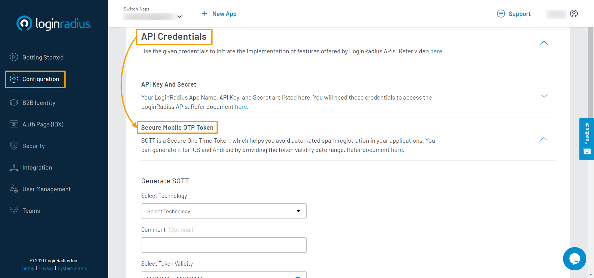

# HTML and JS Tutorial

**HTML** is the standard markup language for documents designed to be displayed in a web browser. It can be assisted by technologies such as Cascading Style Sheets (CSS) and scripting languages such as JavaScript. JavaScript is a programming language, it enables interactive web pages and is an essential part of web applications.

This demo will help you with a quick implementation of the LoginRadius platform with HTML and JS demo.


> <a href="https://accounts.loginradius.com/auth.aspx?return_url=https://dashboard.loginradius.com/login&action=register" target="_blank">Create an account</a> to get started if you don't have one yet!

When you signed up for the LoginRadius account, it created an app for you. This app is linked to a ready to use web page - <a href="https://www.loginradius.com/docs/developer/concepts/idx" target="_blank">Auth Page (IDX)</a>.

Auth Page (IDX) reflects the configuration changes that you make in <a href="https://dashboard.loginradius.com/getting-started" target="_blank">LoginRadius Dashboard</a>. You can utilize this webpage for authentication requirements on your HTML application.


## Choose Theme

In your LoginRadius Dashboard, select your app, then navigate to the **Auth Page (IDX)** section located in the left navigation bar and click the **Theme Customization** section. There you can select a design theme for your login page, or further customize the content displayed:


To preview your login page's theme, click the **Go to your Login Page** link as highlighted on the above screen. 

> Features like Email and Password login, User registration, Forgot password, and Remember me are already configured on your Auth Page(IDX).


## Get Credentials

Before using any of the APIs or Methods that LoginRadius provides, you need to get your **App Name**, **API Key**, and **API Secret**.

- In your LoginRadius Dashboard, navigate to **<a href="https://dashboard.loginradius.com/configuration" target="_blank">Configuration > API Credentials</a>** and click the **API Key And Secret** subsection to retrieve your App Name and API Key:

  

- Now click the the **Secure Mobile OTP Token(SOTT)** subsection, the below screen will appear:

  

- Generate SOTT and make sure to copy the SOTT value (for security reasons, it's only visible once in the LoginRadius Dashboard).


## Set Up HTML Project 

> **Prerequisites :** <li> The web server needs to be set up. Refer the guides <a href="https://www.maketecheasier.com/setup-local-web-server-all-platforms/" target="_blank">here</a> to set up web server locally. You can also set up a small GitHub webserver <a href="https://www.maketecheasier.com/setup-local-web-server-all-platforms/" target="_blank">here</a>.<li> Basic knowledge of HTML and JS.

- Download our HTML and JS demo project from Github <a href="https://github.com/LoginRadius/demo" target="_blank">here</a>, and put it in the root directory of your server.

- Open the `option.js` file and add the following:
  * LoginRadius API Key as obtained from [Get Cedentials](#get-credentials) step.
  * LoginRadius App Name as obtained from [Get Cedentials](#get-credentials) step.
  * SOTT as generated in [Get Cedentials](#get-credentials) step.

```
var commonOptions = {};
commonOptions.apiKey = "<LoginRadius API Key>";
commonOptions.appName = "<LoginRadius Site Name>";
commonOptions.hashTemplate= true;
commonOptions.sott ="<Sott>";
commonOptions.verificationUrl = window.location;//Change as per requirement

var LRObject= new LoginRadiusV2(commonOptions);

```
- After configuring the above options, go to your web browser and type in the root directory URL that your server is hosting.
- Now, you can start the demo and play with the available features in it.

## Run and See Result

1. Fill in your LoginRadius credentials in options.js as described in sections above

2. Execute the index.html file in your browser

3. Create a user by clicking on **Register Here**, upon successful user creation you'll be redirected to Login page


4. Log in. Upon successful login, it will redirect you to the return url with the access token. In response, you will get a user profile in JSON format. Open **Developer Tools** in your browser, navigate to **Console** and you'll find a JSON response. The following displays a sample JSON response:


## Whitelist Domain

For security reasons, LoginRadius processes the API calls that are received from the whitelisted domains. Local domains (http://localhost and http://127.0.0.1) are whitelisted by default.

To whitelist your domain, in your LoginRadius Dashboard, navigate to **<a href="https://dashboard.loginradius.com/configuration" target="_blank">Configuration > Whitelist Your Domain</a>** and add your domain name:


## Explore Demo

* **<a href="https://www.loginradius.com/docs/developer/download/html5-sdk-demo.zip" target="_blank">Refer to GitHub Demo</a>**  to know how to implement various LoginRadius features using SDK Functions.

## Recommended Next Steps

<a href="https://www.loginradius.com/docs/developer/guide/customize-email-and-sms-settings" target="_blank">How to manage email templates for verification and forgot password</a>

<a href="https://www.loginradius.com/docs/developer/guide/customize-auth-page" target="_blank">How to personalize interfaces and branding of login pages</a>

<a href="https://www.loginradius.com/docs/developer/guide/setup-your-smtp-provider" target="_blank">How to configure SMTP settings for sending emails to consumers</a>

<a href="https://www.loginradius.com/docs/developer/guide/social-login" target="_blank">How to implement Social Login options like Facebook, Google</a>

<a href="https://www.loginradius.com/docs/developer/guide/phone-login" target="_blank">How to implement Phone Login</a>

<a href="https://www.loginradius.com/docs/developer/guide/passwordless-login" target="_blank">How to implement Passwordless Login</a>

## HTML SDK Reference

<a href="https://www.loginradius.com/docs/developer/references/SDK/html5-SDK" target="_blank">HTML SDK</a>

## API Reference

[APIs](/#api)

[Go Back to Home Page](/)
