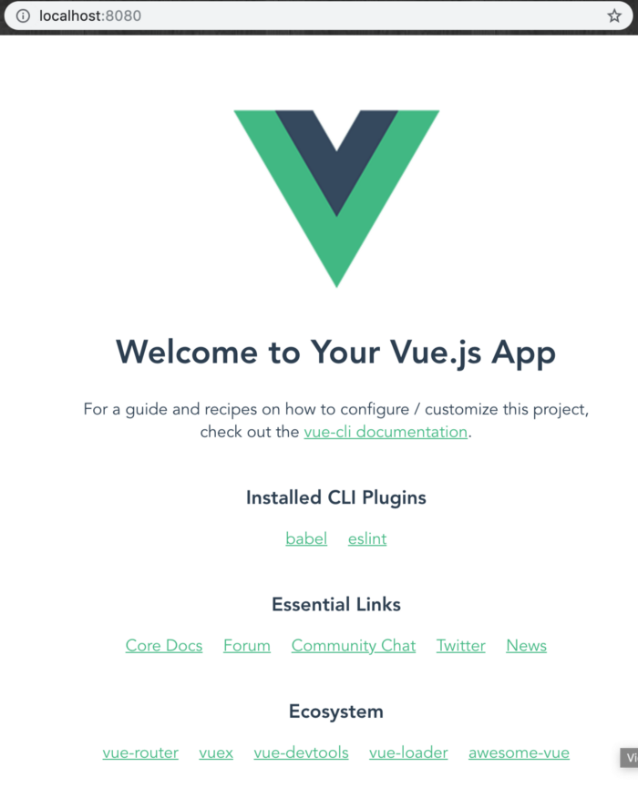

# Get Started - Vue.js

The tutorial lets you implement LoginRadius user registration, login, and view profile on your Vue.js based application.

> [Create an account](https://accounts.loginradius.com/auth.aspx?return_url=https://dashboard.loginradius.com/login&action=register) to get started if you don't have one yet!

When you signed up for the LoginRadius account, it created an app for you. This app is linked to a ready to use web page - [Auth Page (IDX)](https://www.loginradius.com/docs/developer/concepts/idx-overview/).

Auth Page (IDX) reflects the configuration changes that you make in [LoginRadius Dashboard](https://dashboard.loginradius.com/getting-started). You can utilize this webpage for authentication requirements on your Vue.js application.

## Choose Theme

In your LoginRadius Dashboard, select the **Auth Page (IDX)** from the left navigation and then click the **Theme Customization** to select a design theme for your login page, or further customize the content displayed:

To preview your login page's theme, click the **Go to your Login Page** link highlighted on the above screen. 

> Features like Email and Password login, User registration, Forgot password, and Remember me are already configured on your Auth Page(IDX).

## Get Credentials

Before using any of the APIs or Methods that LoginRadius provides, you need to get your **App Name**, **API Key**, and **API Secret**.

In your LoginRadius Dashboard, navigate to **[Configuration > API Credentials](https://dashboard.loginradius.com/configuration)** and click the **API Key And Secret** subsection to retrieve your API Credentials.

## Set Up Vue.js Project

### Install Node.js

Before running a Vue.js app locally, we need NodeJS. NodeJS framework helps in executing JS code without browser.

Follow these guides to setup NodeJS on your PC:

* [For Mac](https://nodejs.org/en/download/package-manager/#macos)
* [For Windows](https://nodejs.org/en/download/)
* [For Linux](https://nodejs.org/en/download/package-manager/)

After installation, (re)start your terminal and type `npm -v`. You might see a version number displayed in your terminal such as:

`6.4.3` 

NodeJS is successfully installed and now we'll use `npm` (Node packet manager) to install Vue.js.  

### Install Vue.js

 In the terminal type following command :

 `npm install -g @vue/cli`

### Generate Vue.js Project

Navigate to the directory where you'd like to set up your Vue JS project and run following command:

`vue create hello-world`

Use arrow keys to select `default` and press **enter/return**:

Once your project is generated, type `cd hello-world`. Wait for the app to compile, and navigate to URL shown on terminal. You should see following:

## Run Vue.js LoginRadius SDK Demo

This section explains the steps included in the setup of the Vue.JS demo and how to run the demo.

1. Clone the Vue demo from GitHub Repo [here](https://github.com/LoginRadius/demo/tree/v2-vue-demo)

2. Install the dependencies by typing `npm install` on your command-line interface.

3. Configure your LoginRadius Credentials in `"/src/assets/options.js"`

4. Run the demo on localhost port 8080 by typing `npm run dev` into your command-line interface.

5. This will open your demo on your default browser.

## Features Implemented in the Demo

Below is the list of features that are included in this demo.

1. Login
2. Register
3. Resend Email Verification
4. Social Login

[Go Back to Home Page](https://lr-developer-docs.netlify.app)
